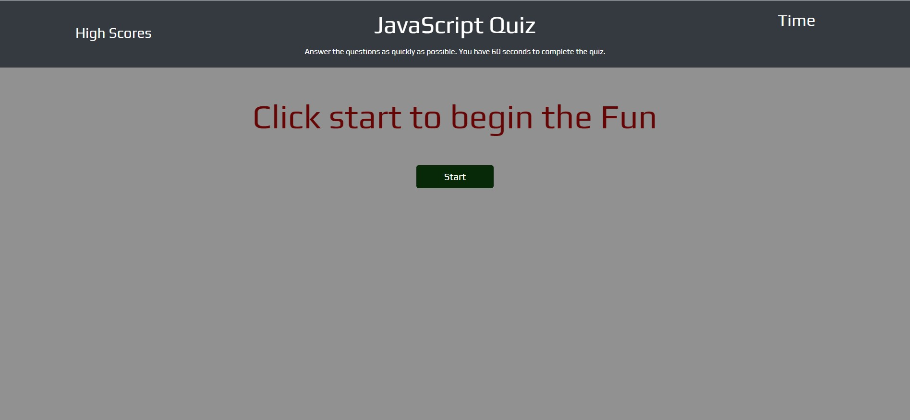
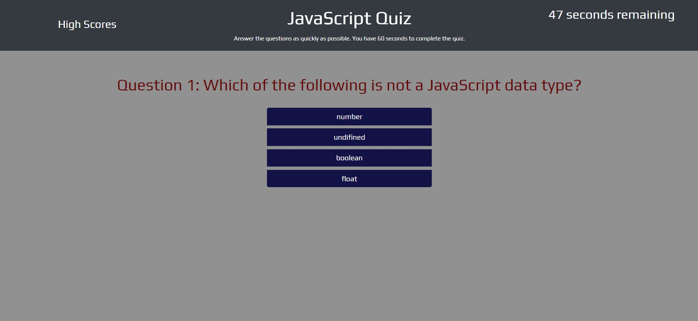
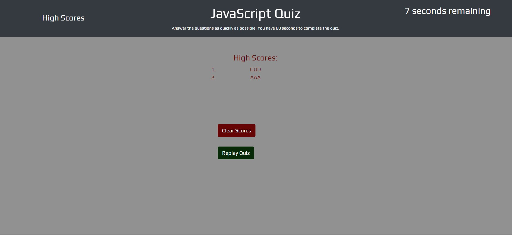

# Code-Quiz

## Description
The objective was to create a fun quiz that would test the users knowlege on JavaScript. The quiz needed to be timed and have a scoring feature.

## Resources
W3 Schools
Stack Overflow
Bootcamp Activities 5, 6, 8, 28

## ScreenShots

